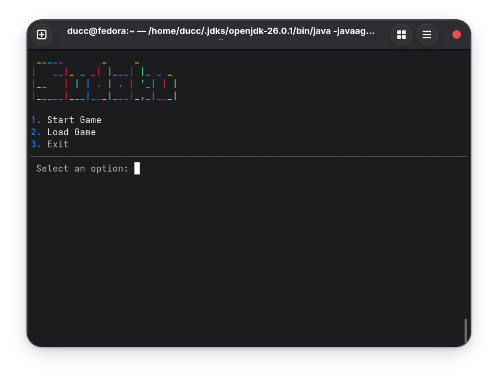
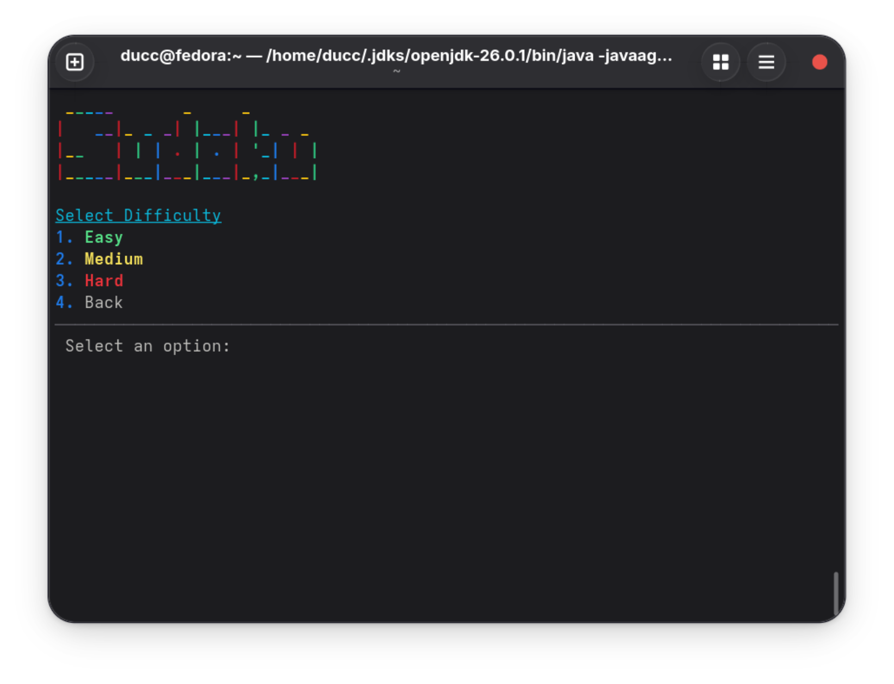
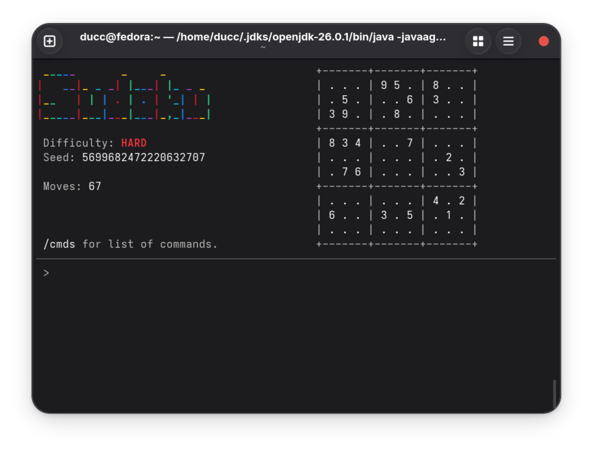
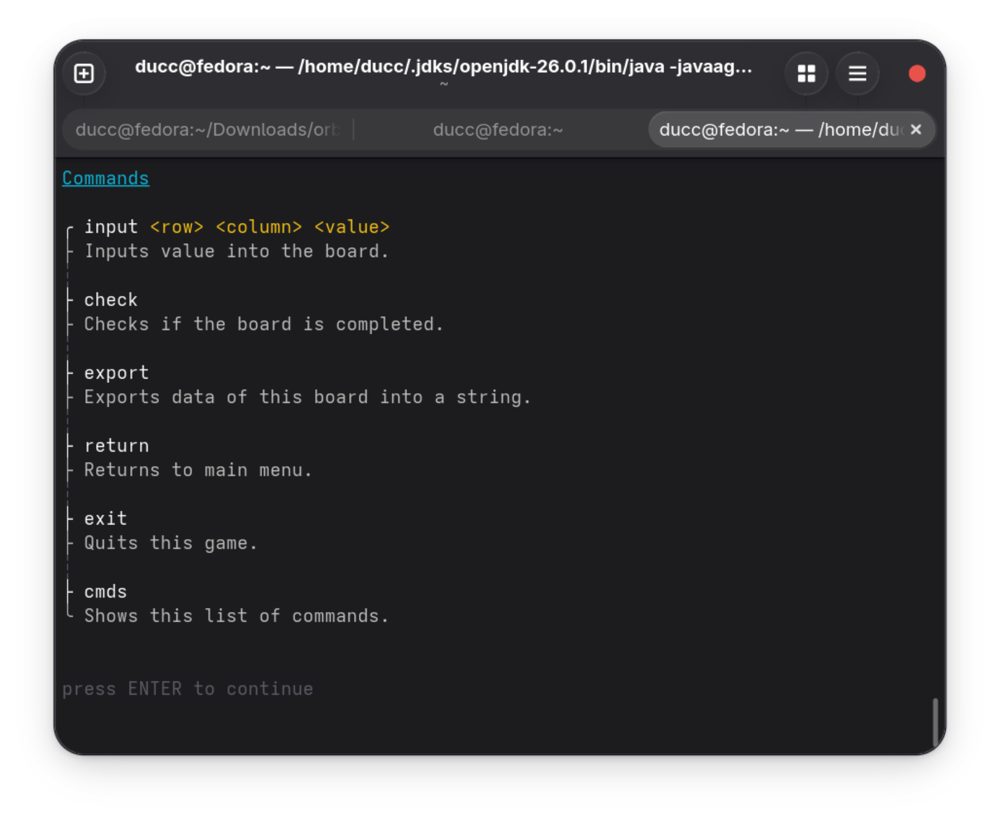

# DIT Assignments

## Checklist
### main.SudokuGame
- [ ] main
  - [ ] UI
- [ ] startGame
- [ ] selectMode
  - [x] start game (random)
  - [ ] load game (seed)
- [ ] Export input data (numbers user inputted)

### main.SudokuBoard
- [x] displayBoard
- [x] setValue
- [x] resetBoard
- [x] loadBoard
- [x] isCellEditable

### main.SudokuValidator
- [x] isValidMove
- [x] checkRow
- [x] checkColumn
- [x] checkSubGrid

### main.GameUtils
- [x] isBoardComplete
- [x] isValidInput
- [x] copyBoard
- [x] generateEmptyBoard

### main.SudokuGenerator
- [x] generateCompleteBoard
- [x] generatePuzzle
- [x] removeCells

## Screenshots

Click to expand

<h3>Main menu</h3>

<h3>Difficulty selection</h3>

<h3>gameplay</h3>

<h3>commands</h3>

